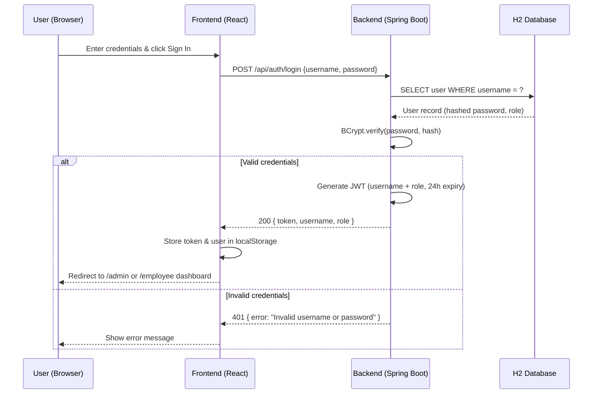
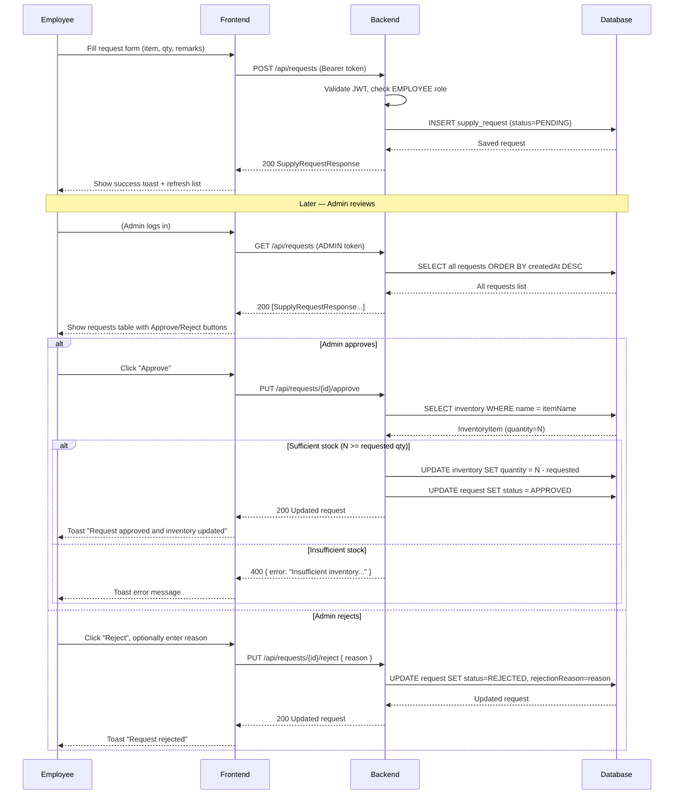

# Office Supply Management System — Architecture

## Overview

A full-stack web application for managing office supply requests with role-based access control. Employees submit supply requests; Admins review, approve, or reject them with automatic inventory updates.

## Tech Stack

| Layer       | Technology                              |
|-------------|-----------------------------------------|
| Backend     | Java 17, Spring Boot 3.2, Maven         |
| Security    | Spring Security 6, JWT (jjwt 0.11.5)   |
| Database    | H2 In-Memory (JPA / Hibernate)          |
| Frontend    | React 18, Vite 5, React Router v6       |
| HTTP Client | Axios                                   |
| Styling     | Plain CSS (CSS Variables)               |

---

## Authentication Flow



---

## Supply Request Lifecycle



---

## Data Model

```
users
  id        BIGINT PK
  username  VARCHAR UNIQUE NOT NULL
  password  VARCHAR NOT NULL (BCrypt)
  role      VARCHAR NOT NULL (ADMIN | EMPLOYEE)

inventory_items
  id          BIGINT PK
  name        VARCHAR NOT NULL
  quantity    INT NOT NULL
  description VARCHAR

supply_requests
  id               BIGINT PK
  employee_id      BIGINT FK → users.id
  item_name        VARCHAR NOT NULL
  quantity         INT NOT NULL
  remarks          VARCHAR
  status           VARCHAR NOT NULL (PENDING | APPROVED | REJECTED)
  rejection_reason VARCHAR
  created_at       TIMESTAMP NOT NULL
  updated_at       TIMESTAMP
```

---

## API Endpoints

| Method | Path                          | Role       | Description                            |
|--------|-------------------------------|------------|----------------------------------------|
| POST   | /api/auth/login               | Public     | Authenticate, returns JWT              |
| GET    | /api/inventory                | ADMIN      | List all inventory items               |
| POST   | /api/inventory                | ADMIN      | Add new inventory item                 |
| PUT    | /api/inventory/{id}           | ADMIN      | Update inventory item                  |
| GET    | /api/requests                 | Any Auth   | Admin: all requests; Employee: own     |
| POST   | /api/requests                 | EMPLOYEE   | Submit new supply request              |
| PUT    | /api/requests/{id}/approve    | ADMIN      | Approve request, decrement inventory   |
| PUT    | /api/requests/{id}/reject     | ADMIN      | Reject request with optional reason    |

---

## Project Structure

```
Office-Supply-Management/
├── backend/
│   └── src/main/java/com/officesupply/
│       ├── config/          SecurityConfig, DataSeeder
│       ├── controller/      AuthController, InventoryController, SupplyRequestController
│       ├── dto/             LoginRequest/Response, InventoryItemRequest/Response,
│       │                    SupplyRequestDto/Response, RejectRequest
│       ├── entity/          User, InventoryItem, SupplyRequest
│       ├── exception/       GlobalExceptionHandler
│       ├── repository/      UserRepository, InventoryItemRepository, SupplyRequestRepository
│       ├── security/        JwtUtil, JwtAuthFilter, UserDetailsServiceImpl
│       └── service/         AuthService, InventoryService, SupplyRequestService
└── frontend/
    └── src/
        ├── context/         AuthContext (JWT state, login/logout)
        ├── components/      Navbar, PrivateRoute, StatusBadge
        ├── pages/           LoginPage, EmployeeDashboard, AdminDashboard
        └── services/        api.js (Axios instance + all API calls)
```
